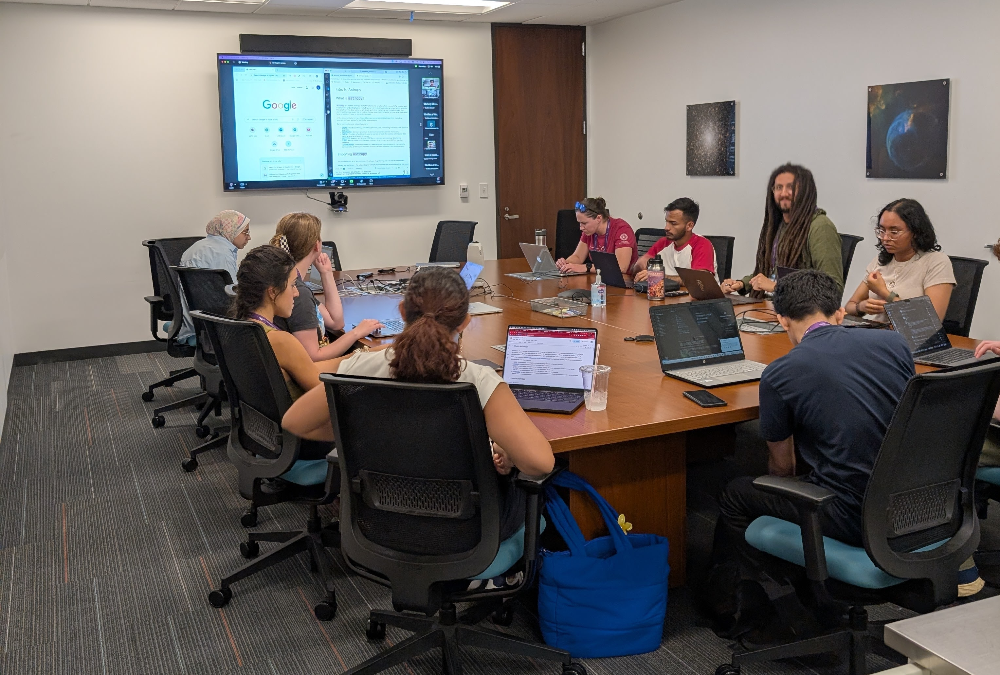
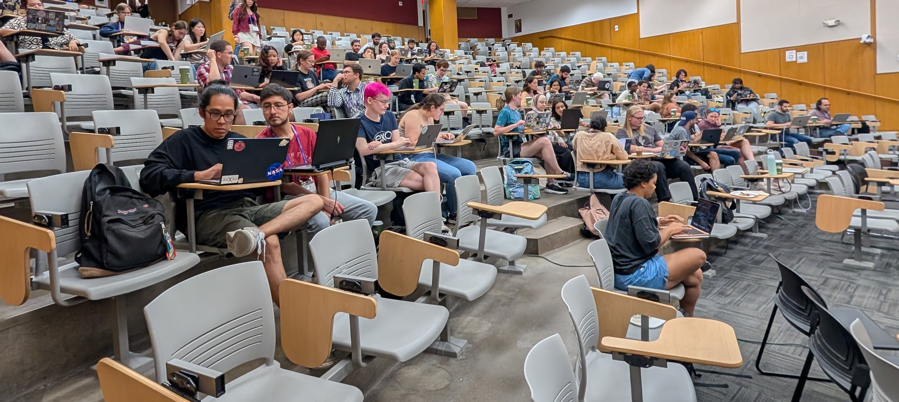

> **Summary:** From August 4 to 8, 2025, I participated in Code/Astro 2025 at [Center for Interdisciplinary Exploration and Research in Astrophysics (CIERA)](https://ciera.northwestern.edu/) at Northwestern University, a workshop focused on best practices in software engineering for astrophysical applications.

  

## Introduction

Nowadays, programming, especially in Python, is one of the most widely used tools for managing, analyzing, and computing all kinds of data in astronomy and astrophysics. In my case specifically, I spend most of my time programming Python code to manage and analyze FITS files, which are the most widely used format in astronomy for storing and sharing astronomical data. In a sense, they are equivalent to the widely known JPG or PNG formats we use to share picture. I also spend a lot of time making plots and fitting models to the data I work on, also using Python. The wide range of applications and uses of code in astronomy makes it necessary for astronomers to learn how to code in the most optimal, maintainable, and useful way, since we usually share our codes publicly.

That is the reason I was interested in participating in Code/Astro, a workshop designed to train astronomers of all academic levels in most of the necessary software development skills for astronomy applications. Participating was important to me because my master's project involves writinga new code to manage photometry data of transiting exoplanets for a intrument we have in the Observatorio Astronómico Nacional San Pedro Mártir.

I would now like to share my experience at Code/Astro. I will discuss my experience applying, participating, and what I learned at this important event.

## Application

  

From the beginning of my master's program, my tutor and I realized that I needed to improve my coding skills because my master's project's main goal was to release a pipeline tool for reducing time series photometry data of transiting exoplanets.

Specifically, I aimed:

- To professionally integrate Git/GitHub (branches, pull requests, and reviews).
- To package a Python project and make it installable.
- To create clear, automated documentation.
- To learn open-source programming practices.

When I submitted my application, I made sure to clearly explain those specific reasons to demonstrate that I had a tangible reason to attend the event.

Applying to Code/Astro is easy. Some programming experience and familiarity with Python or another high-level programming language are required. The workshop is offered in person and remotely. The application process involves filling out a form explaining your interest in participating. All the details can be found on the official website.

I would also like to highlight that all the workshop materials are publicly available at any time. If you would like to start learning these things on your own, you can do so by visiting the:
- [Official Code/Astro website](https://semaphorep.github.io/codeastro/)
- [Code/Astro Github repository](https://github.com/semaphoreP/codeastro)
- [Code/Astro Youtube Playlist](https://www.youtube.com/playlist?list=PLb1880Rn0qkK7zTWcqGaXNbKZbxkpvUuH)

---

## The Workshop

  

The workshop combined theory in the mornings with hands-on practice in the afternoons. I attended all optional sessions to make the most of the experience.

**Mornings — fundamentals and best practices**
- Development environments and programming paradigms  
- Git workflows and GitHub integration  
- Debugging and profiling  
- Documentation and package publishing
- Testing (pytest) and inclusive software practices  

**Afternoons — applied practice**
- NumPy  
- Pandas
- Matplotlib
- Parallel programming 
- Astropy and Astroplan
- Profiling tools

During the week, I collaborated with two colleagues on a short group project: we packaged, documented, and published a Python library.  

---

## Conclusions

Attending Code/Astro was completely meaningful to me, both in terms of what I learned and in terms of the amazing people I met, the places I visited, and my new perspective on astronomy. I think all current and future generations of astronomers should receive training in software development because code is used so extensively in our work.