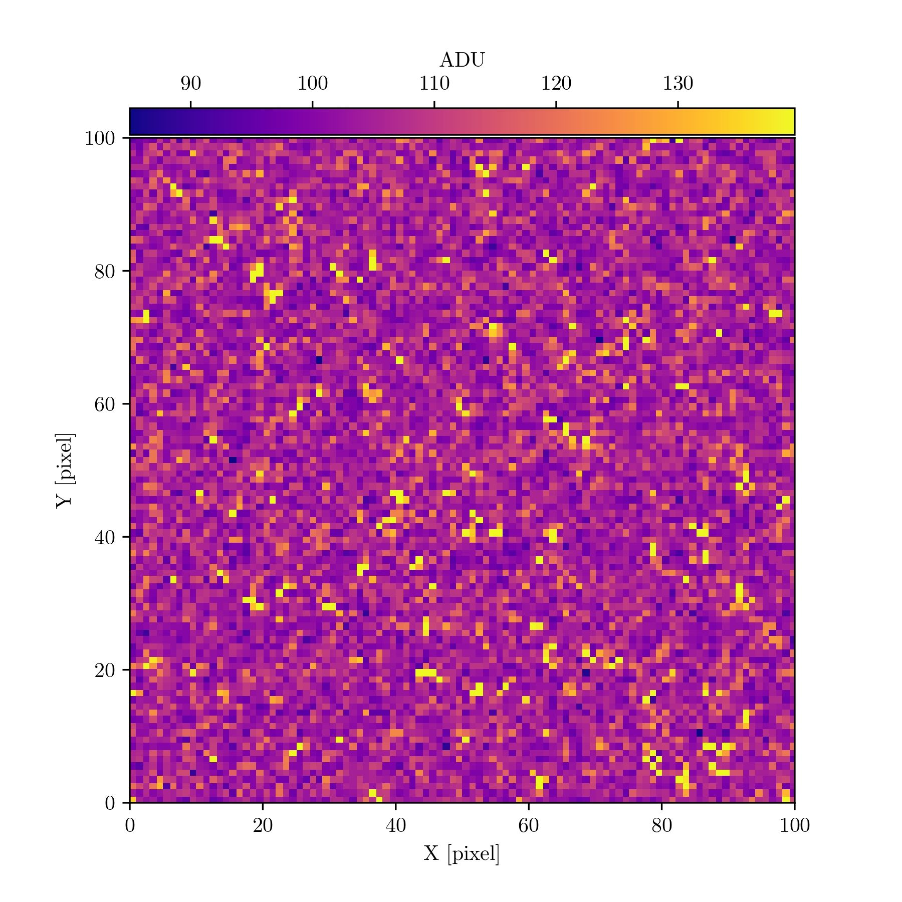
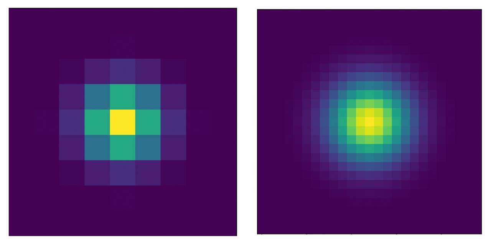
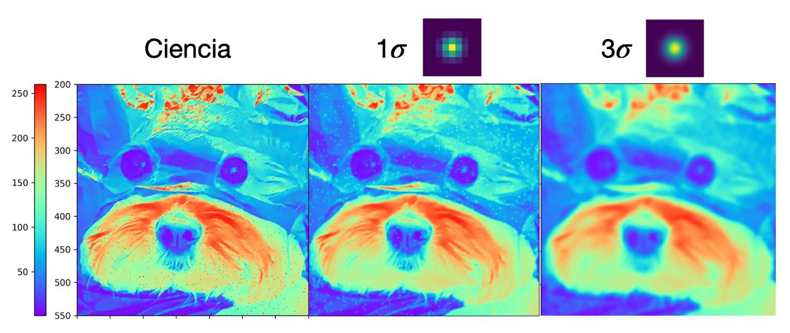
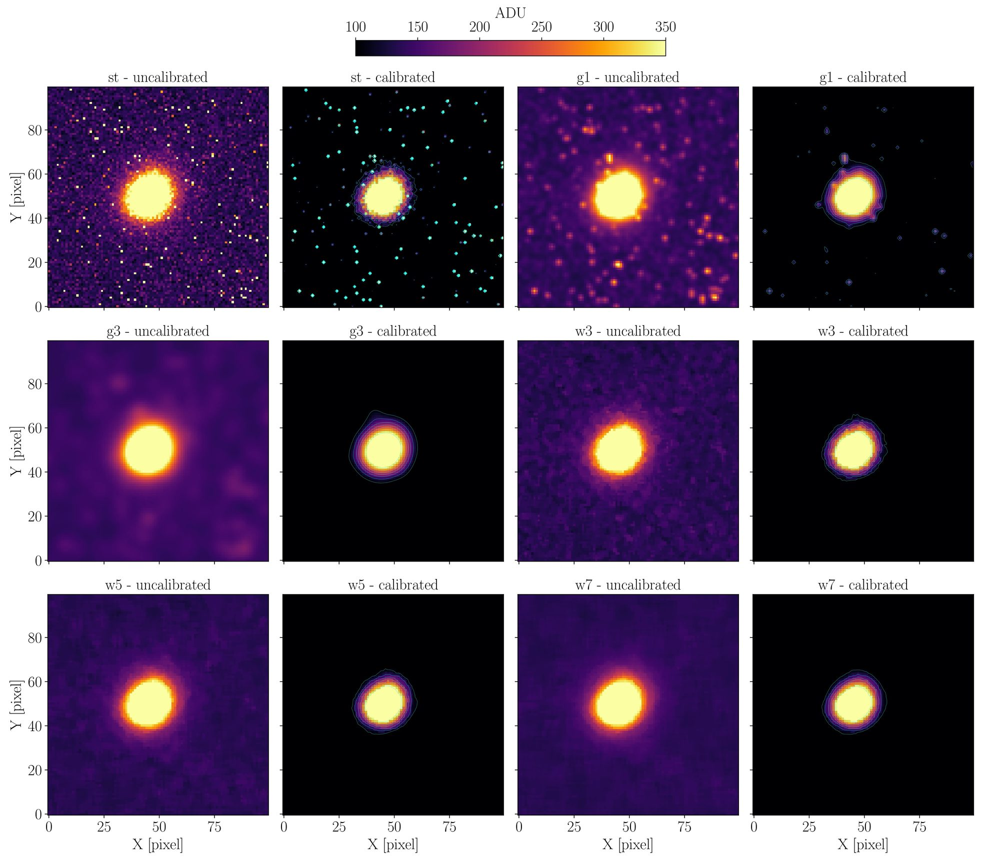

> Here I try to explain in a simple way, for people outside the field of exoplanets and astronomy in general, my master's thesis work published in the journal RAS Techniques and Instruments.

# OPTICAM

  
   
  
    Fig. 1: Opto-mechanical layout of OPTICAM. A, B, and C are the cameras. D, E, and F are filter slots. G, H, I are lenses that receive the light beam and direct it to the cameras. J and K are dichroics that split the light beam coming from the telescope (yellow lines). Credits: <a href="https://www.sciencedirect.com/science/article/pii/S1384107624000769?via%3Dihub">Castro et al. (2024)</a>
  

OPTICAM is an instrument installed on the [2.1m Telescope](https://www.astrossp.unam.mx/es/usuarios/telescopios/tel2m) at the [National Astronomical Observatory in the Sierra de San Pedro Mártir](https://www.astrossp.unam.mx/es/). It has 3 cameras that can take images in three different "colors" simultaneously. This capability is valuable because stars emit different amounts of light at different colors. The colors in which a star shines the most depend on its surface temperature.

In the case of transiting exoplanet studies, observing in three colors simultaneously with very high precision allows us to rule out cases where planet-like signals are actually caused by other astrophysical phenomena.

From the beginning of my master's, I started working with data from this instrument and, together with my advisor, we realized that the images from each camera had a large number of bright pixels, especially at exposure times above 10 seconds. So we set out to analyze the impact these bright pixels had on our transiting exoplanet observations.

# THE PROBLEM
## Warm pixels

When we started analyzing these bright pixels in OPTICAM images, we called them hot pixels; however, we later found that a more accurate term is warm pixels. There are important technical differences reflected in both terms.

We studied their behavior and analyzed how they change between consecutive images. It was important to know whether they were constant, increasing, or decreasing between images or between observation dates. We found that they are unpredictably variable. They change in number and position between images and, most notably, increase with exposure time. We also found that there are several types of warm pixels that behave differently. In our paper, we describe four different behaviors that we identified.

  
   
  
    Fig. 2: A 100×100 pixel cutout from one of OPTICAM's cameras showing warm pixels in more yellow and orange tones. Credits: <a href="https://doi.org/10.1093/rasti/rzag021">Páez et al. (2026)</a>
  

## From images to light curves

With OPTICAM we take sequences of images during the time a planet passes in front of its host star (we actually observe before and after the planet crosses the star), and the result is a few hundred images per camera. To transform these images into a light curve—the data showing the star's brightness level over time—so we can study the transiting planet, we need to perform data reduction and photometry.

Data reduction consists of removing the contribution of known noise sources introduced especially by the detectors and by imperfections in the telescope mirror or instrument lenses, which can accumulate dust or produce other types of aberrations. This process is done by acquiring calibration images and then using software to correct the science frames.

Once data reduction is complete, we use a technique known as differential photometry to measure the star's brightness and convert each image into a data point on the light curve. In short, differential photometry consists of measuring the brightness of the target star (the one hosting a planet) and nearby stars in the sky that serve as comparison. The logic is that if the target star shows a variation that is also seen in the comparison stars, then it is not intrinsic to the star but rather an external variation, for example in the atmosphere. Conversely, if a brightness variation is seen in the target star but not in the comparison stars, then it is intrinsic to that star.

The precision with which we can measure brightness variations of the target star depends on the number of comparison stars used, their level of variability, the brightness level, and other factors related to the telescope, cameras, and detectors. To put the challenge in perspective, studying exoplanets requires precisions that allow us to measure variations of 1% or less in the star's brightness.

  
   
  
    Fig. 3: Full image taken with one of OPTICAM's cameras. The stars used for photometry are labeled: T1 (lower right) is the target star. Those labeled C are comparison stars. Those labeled T other than T1 were discarded.
  

## The role of detectors

The way light from a star is digitally recorded is through a detector. It is an electronic device based on the photoelectric effect that creates a digital image from the light it receives. It works on the same principle as the sensors in all types of cameras. In astronomy, CCD (Charge-Coupled Device) detectors have historically been used to record the light we receive from celestial objects. They offer advantages due to their stability, low noise generation, and high sensitivity. However, there is another type of detector known as CMOS (Complementary Metal-Oxide-Semiconductor) that also relies on the photoelectric effect to generate digital images from light, but with a different electronic architecture. Without going into too much technical detail, scientific-grade CMOS (sCMOS) detectors have established themselves as an alternative to CCDs due to their lower production costs, lower power consumption, and faster image acquisition speeds.

A question here might be: what does this have to do with our transiting planet observations? It turns out that OPTICAM's cameras use sCMOS detectors because it is an instrument designed and optimized for observing rapidly variable astrophysical phenomena, requiring detectors with that capability. However, brightness variations in stars due to transiting planets last from tens of minutes to a few hours, so we do not need OPTICAM's fastest photometry capabilities.

Instead, we use the longest possible cadence, which is 30 seconds. That is, in each image the detectors collect light for 30 seconds, and when that time is up, the image is saved and a new one begins. This allows us to average out scintillation effects in the stars caused by the atmosphere.

The problem is that the warm pixels generated by OPTICAM's sCMOS detectors are significant in images with more than 10 seconds of exposure, which affects the brightness measurements of both the target and comparison stars during photometry and ultimately introduces noise into the light curves. Of course, the more noise we have in our data, the harder it becomes to study transiting planets. That is why our work focused on finding a way to remove warm pixels from OPTICAM images without affecting the stellar signal, thus obtaining more reliable data.

# OUR SOLUTION

## Standard reduction

As I mentioned earlier regarding data reduction, there is a standard procedure for removing various types of noise generated by the detectors and the telescope and instrument optical systems. When we analyzed our observations, we realized that the standard procedure was not capable of removing the warm pixels from the images. However, since it is the established practice, we used its results as a baseline for comparison with the other methods we tested. We evaluated the quality of the reduction in two different ways: first, the precision and amount of correlated noise in the light curves; and second, given that our scientific interest is focused on transiting planets, the "quality" of a planetary model fit to the data, measured using a criterion known as Bayesian evidence.

## Gaussian filters

  
   
  
    Fig. 4: Gaussian filters we tested. On the left, the smallest possible filter, and on the right, the second smallest possible filter.
  

In the literature, methods have been used that consist of processing images using mathematical functions such as a two-dimensional Gaussian distribution to smooth images. We tested two such filters of different "sizes" to evaluate whether they could mitigate the noise introduced by warm pixels in our observations, assessing the precision of the light curves, the amount of noise present, and the quality of the transiting planet model fit.

We found that the smallest possible filter is actually good: it improves the data and reduces the impact of warm pixels compared to the standard reduction. The second Gaussian filter we tested was worse than the standard reduction.

## Median filters

  
   
  
    Fig. 5: Median filters we tested. The gray pixel is the one whose value is reconstructed with the median value of the green pixels. On the left, the smallest possible 3×3 filter; in the middle, a 5×5 filter; and on the right, a 7×7 filter. Pixel sizes do not actually decrease—in this visualization each filter has been drawn at the same physical size, making the pixels appear smaller.
  

We also tested median filters of three different sizes. This type of filter consists of replacing a pixel's value with the median calculated from the surrounding pixels. The filter size refers to how many neighboring pixels are used to calculate the median. For example, the smallest possible filter is a 3×3 pixel filter where the central pixel in that 9-pixel "box" is the one to be replaced, so the median is calculated from the 8 pixels surrounding the central pixel. A 5×5 filter uses the 24 nearest pixels to calculate the median, and a 7×7 filter uses the 48 nearest pixels. Those were the three sizes we evaluated.

We found that using the 3×3 pixel median filter applied to all pixels in each OPTICAM image (just over 4 million pixels per image) and then performing the standard reduction with these filtered images is the best way to handle data from this instrument. We achieved the best precision, the greatest reduction in correlated noise, and the best transit model fit.

This method of correcting warm pixels has several advantages: first, it allows reconstruction of the information lost in damaged pixels, and second, it is easy and computationally "cheap" to implement and scale. So even though we need to apply corrections to millions of pixels across hundreds of images, the process takes no more than a few hours.

## Examples

Below, I illustrate with an image of a dog what the effect is of applying these two types of filters, at their different sizes, to an image. I converted the original color image to grayscale so that each pixel has a single numerical value reflecting its brightness level, and then I changed the grayscale to a color scale that likewise reflects the brightness level of each pixel. To the original image, I added 1% of bright pixels distributed randomly but uniformly, simulating the warm pixels in our OPTICAM images.

  
   
  
    Fig. 6: Gaussian filters. The leftmost panel is a cutout of an image to which I added 1% of very bright pixels, shown in red in the visualization. The middle panel shows the image after applying the smallest Gaussian filter to every pixel. The right panel shows the image after applying the larger Gaussian filter.
  

  
   
  
    Fig. 7: Median filters. The leftmost panel is again a cutout of an image to which I added 1% of very bright pixels. All panels from second to fourth, left to right, show the result after applying the different median filter sizes.
  

# OUR RESULT

The figure below presents the impact of each filter on the images. The top-left panel (*st - uncalibrated*) is the image before applying any filter. The remaining panels show the images after applying each filter, both before (*uncalibrated*) and after (*calibrated*) data reduction.

- **st**: standard reduction
- **g1**: reduction with the smallest possible Gaussian filter
- **g2**: reduction with the second smallest possible Gaussian filter
- **w3**: reduction with the 3×3 median filter—our recommended best filter
- **w5**: reduction with the 5×5 median filter
- **w7**: reduction with the 7×7 median filter
 

  
   
  
    Fig. 8: Results obtained with the different filters to remove warm pixels. Credits: <a href="https://doi.org/10.1093/rasti/rzag021">Páez et al. (2026)</a>
  

# OUR CONTRIBUTION

For this work, we wanted to go beyond just finding a way to remove warm pixels from our OPTICAM observations, so we developed the code that implements our solution. Not only so we can be more efficient when processing our own data, but also so that other users of this instrument for transiting exoplanet observations can incorporate it into their workflows. To that end, we provide a Python package that implements the 3×3 median filter. We called it PROFE (**P**ipeline de **R**educción de **O**pticam para **F**otometría de **E**xoplanetas). PROFE organizes and keeps track of all OPTICAM observations, sorting data by target star and by date. It also adds timestamps needed for light curves and applies the 3×3 median filter using a user-specified number of CPU cores.

Additionally, once the standard reduction with the filtered images and the photometry in software such as AstroImageJ is complete, PROFE can take the photometric measurements and create scientific and diagnostic products such as light curve plots, airmass plots, the star's trajectory across the sky during the observation, and more. This allows anyone using OPTICAM for transiting exoplanet data to quickly have scientific products to share with colleagues or with exoplanet follow-up programs such as the [TESS Follow-up Observing Program](https://exofop.ipac.caltech.edu/tess/).

# Final note:

My goal with this short write-up is to make my master's thesis work—which led to the publication of my first scientific paper as first author in the field of exoplanets—accessible to people who are not specialized in astronomy, exoplanets, data reduction techniques, or who simply prefer reading in English. However, I have made many simplifications and avoided technicalities that are necessary to fully understand the detail and background of this work, carried out with Dr. Yilen Gómez Maqueo Chew and Dr. Leslie Hebb. Of course, I invite anyone interested in learning more or with questions to contact me. I will be happy to respond.

