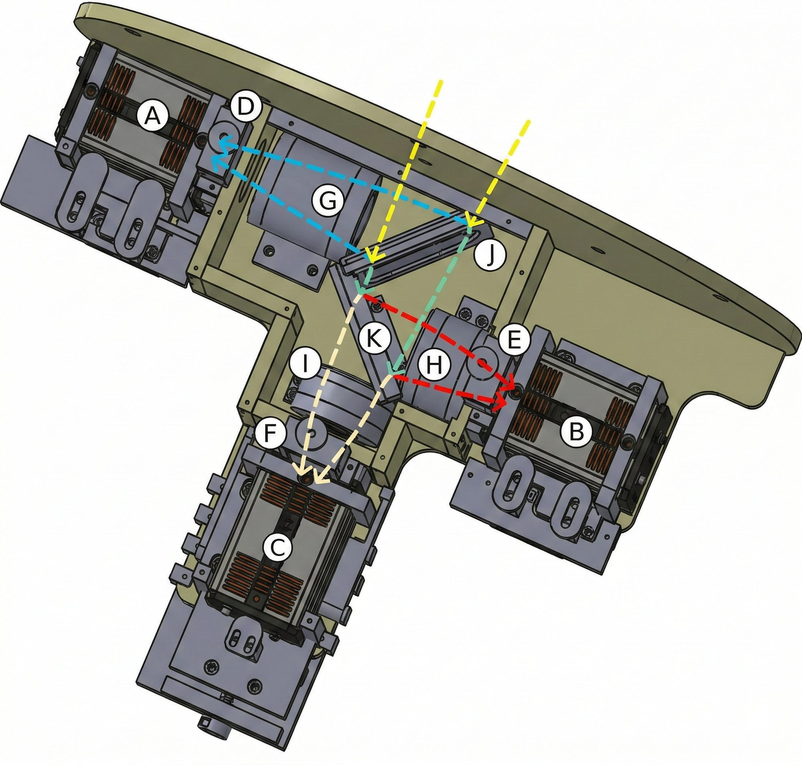
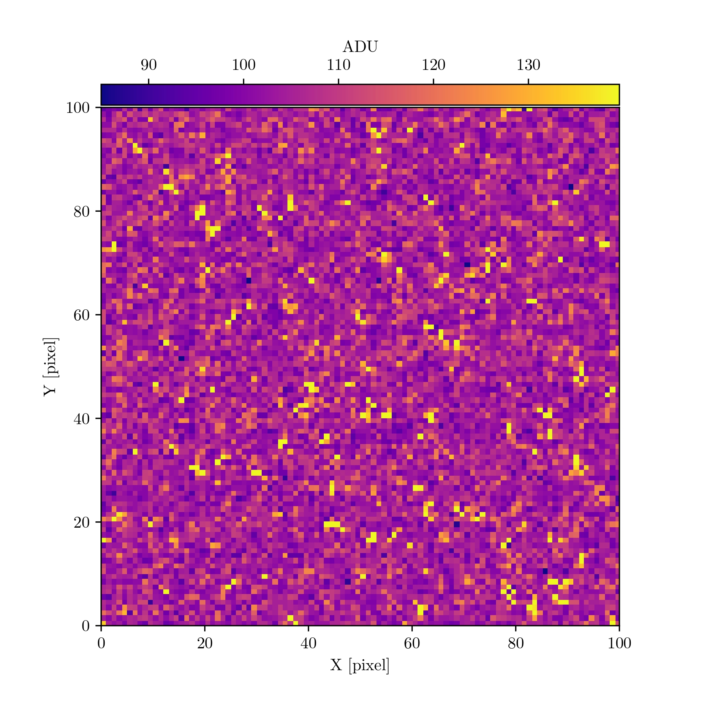
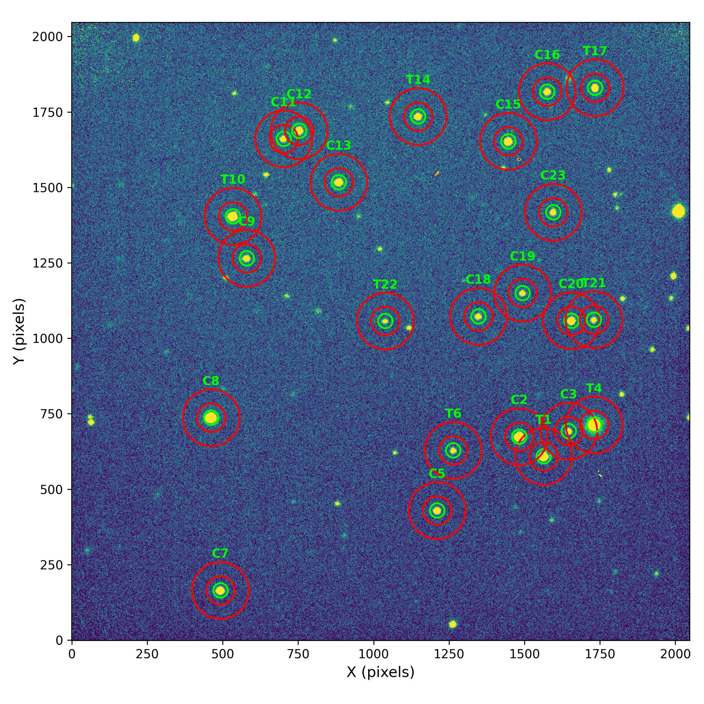
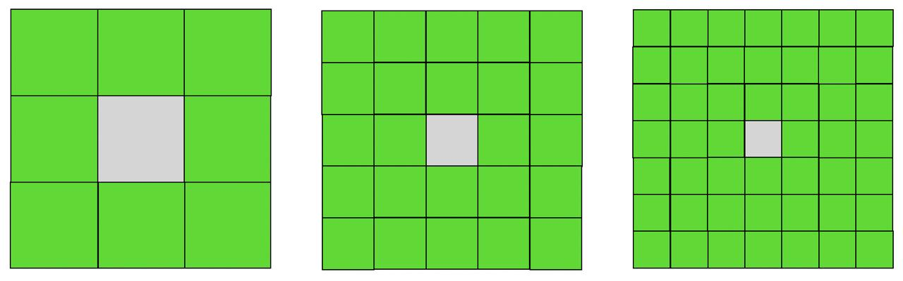
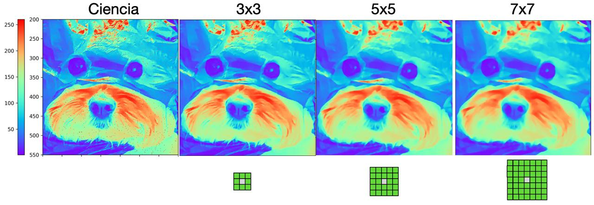
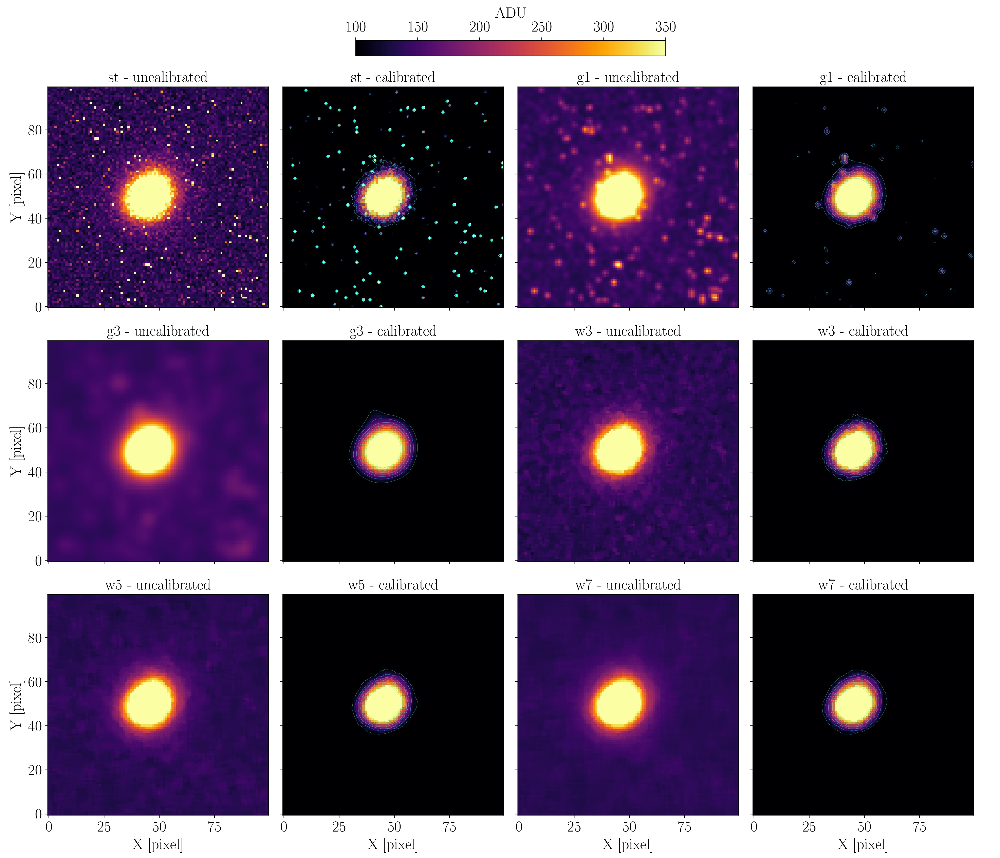

> Aquí intento explicar de manera sencilla para personas fuera del campo de los exoplanetas y la astronomía en general, mi trabajo de maestría publicado en la revista RAS Techniques and Instruments.

# OPTICAM

  
   
  
    Fig. 1: Esquema óptico-mecánico de OPTICAM. A, B y C son las cámaras. D, E y F son espacios para filtros. G, H, I son lentes que reciben el haz de luz para dirigirlo a las cámaras. J y K con dicroicos que permiten dividir del haz de luz que viene del telescopio (líneas amarillas). Créditos: <a href="https://www.sciencedirect.com/science/article/pii/S1384107624000769?via%3Dihub">Castro et al. (2024)</a>
  

OPTICAM es un instrumento que se instala en el [Telescopio de 2.1m](https://www.astrossp.unam.mx/es/usuarios/telescopios/tel2m) del [Observatorio Astronómico Nacional en la Sierra de San Pedro Mártir](https://www.astrossp.unam.mx/es/) y tiene 3 cámaras que permiten tomar imágenes en tres "colores" diferentes. Esto esta capacidad es valiosa porque las estrellas emiten diferentes cantidades de luz en diferentes colores. Los colores en los que más brilla dependen de la temperatura a la que está la superficie. 

En el caso del estudio de exoplanetas transitantes, observar en tres colores al mismo tiempo y con muy alta precisión permite descartar casos donde señales parecidas a las de planetas son en realidad originadas por otros fenómenos astrofísicos.

Desde el principio de mi maestría, comencé a trabajar con datos de este instrumento y junto con mi tutora nos dimos cuenta de que las imágenes de cada cámara tenían gran cantidad de píxeles brillantes, especialmente en tiempos de exposición de más de 10 segundos, por lo que nos propusimos analizar el impacto que tenían estos píxeles brillantes en nuestras observaciones de exoplanetas en tránsito. 

# EL PROBLEMA
## Píxeles tibios

Cuando comenzamos a analizar estos píxeles brillantes en las imágenes de OPTICAM les llamamos píxeles calientes, sin embargo después encontramos que un mejor término para nombrarlos es píxeles tibios. Hay diferencias técnicas importantes reflejadas en ambos términos. 

Estudiamos su comportamiento y analizamos cómo cambian entre cada imagen en una serie consecutiva. Fue importante saber si son constantes, si aumentan o si disminuían entre imágenes o entre fechas de observación. Encontramos que son impredeciblemente variables. Cambian en número y posición entre imágenes y principalmente, aumentan con el tiempo de exposición. También encontramos que hay varios tipos de píxeles tibios que se comportan diferente. En nuestro artículo, describimos cuatro comportamientos diferentes que logramos identificar. 

  
   
  
    Fig. 2: Recorte de 100x100 píxeles de una cámara de las cámaras de OPTICAM donde se ven los pixeles tibios con tonos más amarillos y naranjas. Créditos: <a href="https://doi.org/10.1093/rasti/rzag021">Páez et al. (2026)</a>
  

## De imágenes a curvas de luz

Con OPTICAM tomamos secuencias de imágenes durante el tiempo que dura un planeta pasando frente a su estrella anfitriona (en realidad observamos antes y después de que el planeta pasa frente a la estrella) y el resultado son algunos cientos de imágenes por cada una de las cámaras. Para trasformar estas imágenes en una curva de luz, que son los datos de nivel de brillo de la estrella a lo largo del tiempo, y poder analizar el planeta que pasó en frente, necesitamos realizar la reducción de datos y la fotometría. 

La reducción de datos consiste en quitar la contribución de ruidos conocidos que son introducidos especialmente por los detectores y por imperfecciones en el espejo del telescopio o los lentes del instrumento y que pueden acumular polvo o generar otro tipo de aberraciones. Este proceso se hace adquiriendo imágenes de calibración y luego mediante un procesamiento con software se corrigen las imágenes científicas. 

Una vez se ha hecho la reducción de datos, usamos una técnica que se conoce como fotometría diferencial para medir el brillo de la estrella y convertir cada imagen en un dato de la curva de luz. La fotometría diferencial, en pocas palabras, consiste en medir el brillo de la estrella de interés (la que alberga un planeta) y estrellas cercanas en el cielo que sirven de comparación. La lógica es que sí la estrella con el planeta, tiene una variación que también se ve en las estrellas de comparación, entonces no es una variación propia de la estrella sino una variación externa, por ejemplo en la atmósfera. Por el contrario, si se ve una variación en el brillo de la estrella de interés y esa variación no se ve en las estrellas de comparación entonces es una variación propia de esa estrella. 

La precisión con la que se pueden medir las variaciones en el brillo de la estrella de interés depende del número de estrellas de comparación que se usaron, el nivel de variación es estas, el nivel de brillo y otros factores relacionados al funcionamiento del telescopio, las cámaras y los detectores. Para dimensionar el reto, para estudiar exoplanetas necesitamos alcanzar precisiones que nos permitan medir variaciones del 1% o menos en el brillo de la estrella. 

  
   
  
    Fig. 3: Imagen completa tomada con una de las cámaras de OPTICAM. Están señaladas las estrellas que se usaron para la fotometría: T1 (parte inferior derecha) es la estrella de interés. Las que están señaladas con C son las usadas de comparación. Las que están señaladas con T diferentes a T1, fueron descartadas.
  

## El papel de los detectores

La forma en que la luz proveniente de una estrella se registra de manera digital es mediante un detector. Es un dispositivo electrónico que se basa en el efecto fotoeléctrico para crear una imagen digital a partir de la luz que recibe. Es el mismo principio que usan los sensores en todo tipo de cámaras. En astronomía, los detectores tipo CCD (dispositivo de carga acoplada) se han usado históricamente para registrar la luz que recibimos de cuerpos celestes. Tienen ventajas dadas por su estabilidad, baja generación de ruido y alta sensibilidad. No obstante, existe otro tipo de detectores que se conocen como CMOS (semiconductores complementarios de óxido metálico) que también se basan en el efecto fotoeléctrico para generar imágenes digitales a partir de la luz, pero con una arquitectura electrónica diferente. Sin entrar en detalles técnicos, los CMOS de calidad científica (sCMOS) se han consolidado como una alternativa a los CCDs por sus bajos costos de producción, menor consumo energético y mayor velocidad al tomar y guardar imágenes científicas. 

Una pregunta aquí podría ser ¿qué tienen que ver esto con nuestras observaciones de planetas en tránsito? Resulta que las cámaras de OPTICAM usan detectores tipo sCMOS porque es un instrumento diseñado y optimizado para observar fenómenos astrofísicos rápidamente variables, por lo que se necesitan detectores con esa capacidad. Sin embargo, las variaciones en el brillo de las estrellas debido a planetas transitantes, duran entre decenas de minutos a algunas horas, por lo que no necesitamos las capacidades de fotometría más rápida que tiene OPTICAM. 

Por el contrario, usamos la candencia más larga posible que es de 30 segundos. Es decir en cada imagen los detectores duran 30 segundos recibiendo luz y cuando pasa ese tiempo se guarda la imagen y se comienza a tomar una nueva. Esto nos permite evitar efectos de centelleo en las estrellas debido a la atmósfera. 

El problema con esto, es que los píxeles tibios que observamos los generan los detectores sCMOS de OPTICAM son una cantidad significativa en imágenes con más de 10 segundos de exposición, lo que afecta las mediciones del brillo de la estrella de interés y las de comparación cuando hacemos la fotometría y al final, introducen ruido en las curvas de luz. Por supuesto, entre más ruido tengamos en nuestros datos más se dificultan nuestras investigaciones de planetas en tránsito. Por eso, nuestro trabajo se centro en encontrar la forma de eliminar los píxeles tibios de las imágenes de OPTICAM sin afectar la señal de las estrellas y con eso tener datos más confiables. 

# NUESTRA SOLUCIÓN

## Reducción estándar

Como dije antes cuando mencioné la reducción de datos, hay una forma de eliminar varios tipos de ruido generado tanto por los detectores como por el sistema óptico del telescopio y del instrumento. Cuando analizamos nuestras observaciones, nos dimos cuenta de que el procedimiento estándar no es capaz de eliminar los píxeles tibios de las imágenes. Sin embargo, como es la práctica adoptada, usamos los resultados con esta metodología de reducción para tener un punto de comparación entre los otros métodos que probamos. Evaluamos de dos formas diferentes la calidad de la reducción: la primera fue la precisión y cantidad de ruido correlacionado en las curvas de luz; y la segunda, dado que nuestros interés científico está enfocado en los planetas transitantes, fue la "calidad" del ajuste de un modelo planetario a los datos medida mediante un criterio que se conoce como evidencia Bayesiana.

## Filtros Gaussianos

  
   
  
    Fig. 4: Filtros Gaussianos que probamos. A la izquierda el filtro más pequeño posible y a la derecha el segundo más pequeño posible.
  

En la literatura, se han usado métodos que consisten en procesar imágenes usando funciones matemáticas como la de una distribución Gaussiana bidimensional para suavizar imágenes. Probamos dos filtros de este tipo con diferente "tamaño" para evaluar si estos eran capaces de mitigar el ruido introducido por los píxeles tibios en nuestras observaciones y evaluamos la precisión de las curvas de luz, la cantidad de ruido presente y la calidad del ajuste del modelo de un planeta transitante. 

Encontramos que el filtro más pequeño posible es de hecho bueno: mejora los datos y disminuye el impacto de los píxeles tibios de las imágenes en comparación con la reducción estándar. El segundo filtro de este tipo que usamos, fue peor que la reducción estándar. 

## Filtros por la mediana

  
   
  
    Fig. 5: Filtros por la mediana que probamos. El pixel gris es el píxel cuyo valor es reconstruido con el valor mediano de los píxeles verdes. A la izquierda el filtro más pequeño posible de 3x3, en el medio un filtro de 5x5 y a la derecha un filtro de 7x7. El tamaño de los píxeles no disminuye, en esta visualización cada filtro tiene el mismo tamaño haciendo los píxeles más pequeños.
  

También probamos usar filtros por la mediana de tres tamaños diferentes. Este tipo de filtros consiste en reemplazar el valor de un píxel con la mediana calculada a partir de los píxeles que están a su alrededor. El tamaño del filtro se refiere a la cantidad de píxeles cercanos que se usan para calcular la mediana. Por ejemplo, el filtro más pequeño posible es un filtro de 3x3 píxeles donde el píxel central en esa "caja" de 9 píxeles es el que se va a reemplazar, entonces la mediana se calcula con los 8 píxeles alrededor del píxel central. Un filtro de 5x5 toma los 24 píxeles más cercanos para calcular la mediana y uno de 7x7 toma los 48 píxeles más cercanos. Esos fueron los tres tamaños que evaluamos.

Encontramos que usar el filtro con el tamaño de 3x3 píxeles aplicado a todos los píxeles en cada imagen de OPTICAM (poco más de 4 millones de píxeles por imagen) y luego hacer la reducción estándar con estas imágenes filtradas es la mejor forma de tratar los datos de este instrumento. Alcanzamos la mejor precisión, la mayor eliminación de ruido correlacionado y el mejor ajuste en el modelo de tránsito. 

Esta forma de corregir los píxeles tibios tiene varias ventajas, la primera es que permite reconstruir la información que se pierde en los píxeles dañados y la segunda es que es fácil y "barato" de implementar y escalar computacionalmente. Por lo que aunque tengamos que hacer correcciones a millones de píxeles en cientos de imágenes, el proceso no tardará más que algunas horas. 

## Ejemplos

A continuación, ilustro con una imagen de un perrito, cual es el efecto de aplicar estos dos tipos de filtros, y sus diferentes tamaños en una imagen. La imagen original a color, la convertí a una escala de grises para que cada pixel tenga un solo valor numérico que refleje cual es su nivel de brillo y luego cambié la escala de grises a una escala de colores que igualmente reflejan el nivel de brillo en cada píxel. A la imagen original, le agregué un 1% de pixeles brillantes distribuidos de manera aleatoria pero uniforme de manera que simulan los pixeles tibios en nuestras imágenes de OPTICAM. 

  
   
  
    Fig. 6: Filtros gaussianos. El recuadro de la izquierda es un recorte de una imagen a la que le agregué 1% de píxeles muy brillantes que se ven rojos en la visualización. El panel del centro es cómo queda la imagen después de aplicar el filtro gaussiano más pequeño cada píxel en la imagen. El panel de la derecha muestra como queda la imagen después de aplicar el otro tamaño de filtro.
  

  
   
  
    Fig. 7: Filtros por la mediana. El recuadro de la izquierda es nuevamente un recorte de una imagen a la que le agregué 1% de píxeles muy brillantes. Todos los paneles desde el segundo hasta el cuarto de izquierda a derecha muestran cómo quedan después de aplicar los diferentes tamaños de filtros por la mediana. 
  

# NUESTRO RESULTADO

La Figura a continuación presenta el impacto de cada filtro en las imágenes. El recuadro arriba a la izquierda (*st - uncalibrated*) es la imagen antes de aplicar cualquier filtro. Los demás recuadros son cómo quedan las imágenes después de aplicar cada filtro pero antes (*uncalibrated*) y después (*calibrated*) de aplicar la reducción de datos.

- **st**: es la reducción estándar
- **g1**: es la reducción con el filtro gaussiano más pequeño posible
- **g2**: es la reducción con el segundo filtro gaussiano más pequeño posible
- **w3**: es la reducción con el filtro por la mediana de 3x3 píxeles y nuestra propuesta de mejor filtro
- **w5**: es la reducción con el filtro por la mediana de 5x5 píxeles
- **w7**: es la reducción con el filtro por la mediana de 7x7 píxeles
 

  
   
  
    Fig. 8: Resultados que obtuvimos con los diferentes filtros para remover píxeles tibios.  Créditos: <a href="https://doi.org/10.1093/rasti/rzag021">Páez et al. (2026)</a>
  

# NUESTRO APORTE

Para este trabajo, quisimos ir más allá de solo encontrar una forma de eliminar los píxeles tibios en nuestras observaciones con OPTICAM y por eso desarrollamos el código que implementa nuestra solución. No solo para que podamos ser más eficientes al procesar nuestros propios datos sino para que otras personas que usan este instrumento para observaciones de exoplanetas en tránsito puedan incorporarlo a sus flujos de trabajo. En ese sentido, ponemos a disposición un paquete de código en Python que implementa el filtro por la mediana de 3x3 píxeles. Lo llamamos PROFE (**P**ipeline de **R**educción de **O**pticam para **F**otometría de **E**xoplanetas). PROFE organiza y lleva un registro de todas las observaciones que tengamos con OPTICAM y organiza los datos por cada estrella observada y por cada fecha. También agrega marcas de tiempo necesarias para las curvas de luz y aplica el filtro por la mediana de 3x3 usando una cantidad núcleos del procesador determinada por la persona usuaria. 

Adicionalmente, una vez se ha hecho la reducción estándar con las imágenes filtradas y la fotometría en algún software como AstroImageJ, PROFE es capaz de tomar las mediciones fotométricas y crear productos científicos y de diagnóstico como gráficas de curvas de luz, de masa de aire, de la trayectoria de la estrella en el cielo durante la observación, entre otros. Permitiendo, que quien use OPTICAM para tomar datos de exoplanetas transitantes pueda tener rápidamente productos científicos para compartir con colegas o con programas de seguimiento de exoplanetas como el [TESS Follow-up Observing Program](https://exofop.ipac.caltech.edu/tess/). 

# Nota final:

Mi objetivo con este corto escrito es que personas no especializadas en astronomía, exoplanetas, técnicas de reducción o que no lean en inglés puedan conocer de manera general mi trabajo de maestría que llevó a la publicación de mi primer artículo científico como primer autor en el campo de los exoplanetas. Sin embargo, he hecho muchas simplificaciones y evitado tecnicismos que son necesarios para comprender el detalle y trasfondo de este trabajo que realizamos con la Dra. Yilen Gómez Maqueo Chew y la Dra. Leslie Hebb. Por supuesto, invito a cualquier persona interesada en saber más o con dudas a contactarme. Estaré encantado de responder. 

