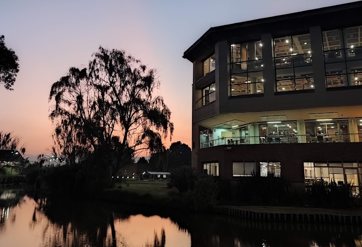
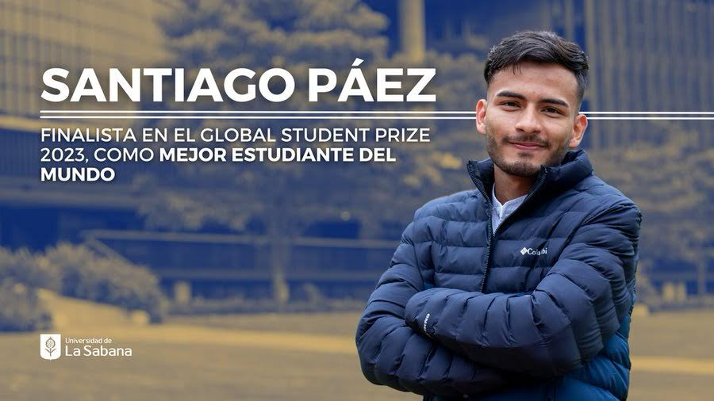
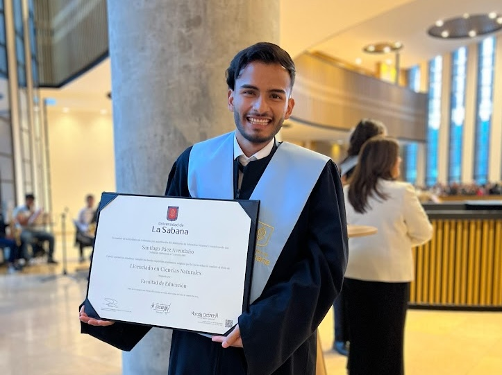

> En esta entrada cuento cómo viví mi pregrado en la Universidad de La Sabana: lo que más me marcó, lo que estuvo difícil y cómo este camino me llevó a convertirme en profe de ciencias naturales, un paso importante en mi formación hacia la astronomía.

## Admisión en La Sabana y cómo pagarla

  

En el último año de bachillerato ya sabía qué hacer para ser astrónomo. Quería estudiar Física en la Universidad Nacional de Colombia y luego Astronomía. Pero no funcionó porque no conseguí ni 600 puntos en el examen de admisión. Eso no me servía para entrar en la carrera. El plan B era estudiar alguna ingeniería en la Universidad Distrital Francisco José de Caldas y luego hacer un posgrado en astronomía con las bases de matemáticas y física que tendría. Para entrar en la Distri había que tener buen puntaje en el ICFES, un examen nacional que hacen todos los estudiantes colombianos al acabar el bachillerato y que es muy importante para los que venimos de contextos menos favorecidos. Sobre todo para obtener becas de estudio o entrar en la universidad.

Mientras hacía lo del proceso de admisión de la Distri, nos invitaron a un taller en la Universidad de La Sabana para conocer el campus y la nueva carrera de Licenciatura en Ciencias Naturales (LCN). La Universidad de La Sabana es una universidad privada ubicada a 7 km al norte de Bogotá, en el municipio de Chía. Usme, donde yo vivía, está en el extremo suroriental de la ciudad. Hasta entonces, solo sabía que la Universidad de La Sabana era cara. En el taller nos enseñaron el campus y detalles sobre la LCN, como el plan de estudios, el perfil de estudiantes y egresados, y las oportunidades de financiación.

No había pensado en estudiar pedagogía porque no veía relación entre mis planes de ser astrónomo y tener un título de educación. Pregunté a los responsables del taller si podría hacer una maestría en astronomía haciendo esa carrera. Aunque no me lo dijeron directamente, me aseguraron que tendría una buena formación en ciencias naturales y matemáticas, y que contaría con profesores de astronomía de quienes podría aprender. Vi que estudiar la LCN también me serviría para mis planes, así que ese día del taller me inscribí.

Mi familia no tenía dinero para pagar una carrera en La Sabana ni en ninguna otra universidad privada. Pero nos hablaron de un crédito de la Secretaría de Educación Distrital (SED) que podría pagar todo el semestre en una universidad privada y dar una ayuda de manutención. El programa se llamaba FEST y ayudaba a estudiantes que tienen buenos resultados en el examen del ICFES y dificultades económicas. Entonces mi plan C para ser astrónomo fue estudiar la LCN con un crédito condonable.

Me admitieron en la Universidad de La Sabana, pero el proceso de la financiación era lento y lleno de incertidumbre. Por esas mismas fechas, me notificaron que tampoco me habían admitido en la Distrital. Así que mis tres planes para acceder a la educación superior se redujeron a uno, que dependía de que recibiera financiación completa de la SED. Podía esperar un semestre y prepararme para volver a intentar el examen de Nacho, pero no quería esperar. Quería empezar la universidad apenas terminar el colegio.

Después de varios días de incertidumbre, a finales de diciembre de 2018 se publicaron los resultados de la SED y mi nombre aparecía en la lista de beneficiarios. Fue un momento importante: me convertí en el primer miembro de mi familia en recibir una beca para estudiar en la universidad y terminaría. El financiamiento era un crédito era condonable, así que por supuesto había mucha presión: si no terminaba la carrera, debía devolver todo lo que se había invertido en mí, con intereses. Habría tardado años en pagar el crédito, como muchas personas en Colombia.

## La Licenciatura en Ciencias Naturales

  

No puedo describir con detalle cómo viví los diez semestres de mi carrera ni relatar cronológicamente los distintos momentos. En cinco años, pasé de ser uno a otro: crecí en lo profesional y personal, conocí a personas increíbles e hice amigos para siempre. También viajé y conocí muchos lugares. De cada lugar me llevé algo para mi vida. Estudiar en La Sabana me cambió la vida en muchos sentidos.

El CV en esta página, registra lo que hice entre 2019 y 2024, que son las fechas de mis estudios universitarios. Hice prácticas en colegios, museos, alcaldías y el planetario. También fui tutor de estudiantes becarios, lideré un grupo de estudiantes y trabajé para la universidad. No voy a contar todo lo que hice, sino dar una visión general de mi experiencia.

Creo que lo que más marcó mi etapa de licenciatura fue la dedicación que puse en la universidad. Sabía que era una oportunidad única. Nunca fui solo a clase y regresarme a casa, sino que pasaba más de doce horas diarias en el campus (verán que es un hábito que nunca he dejado). Durante los dos primeros semestres, lo hacía por practicidad. Vivía en La Fiscala, en Usme, y para llegar a clase a las 7 a. m., tenía que salir de mi casa a las 4 a. m. Tomaba el alimentador, un Transmilenio (B75 o B72), desde el Portal Usme hasta el Portal Norte, y luego un autobús que iba para Chía y me dejaba frente a la universidad. Volvía a casa sobre las 7 p. m. y llegaba a las 10 p. m., si tenía suerte.

Salía y regresaba a la misma hora, aunque mis clases no empezaran ni acabaran a las 7 a. m. o a las 7 p. m. Lo hacía por dos razones.
Era la forma más fácil de saber cuánto tiempo necesitaba para ir y venir de casa a la universidad. Si cambiaba mis horarios, nunca sabría cuánto tiempo me llevaría cada trayecto, ya que la ciudad cambia y el tiempo de viaje varía durante el día.
En la universidad tenía mejores escritorios, sillas, salas de estudio, computadores y conexión a internet que en mi casa, así que pasaba todo el día allí. Intentaba usar todo lo que la universidad ofrecía. Sabía que era un privilegio poder dedicarse solo a estudiar. Muchos tienen que trabajar para vivir o ayudar en casa. Mi familia me apoyaba y creo que esa fue una manera de agradecer ese apoyo.

Durante los dos primeros semestres todo fue igual, pero en tercero me mudé cerca de la universidad. Aun así, iba todo el día al campus. Me acostumbré a hacer todo allí y no era tan productivo en casa. Estudiar en la universidad me llevó a participar en muchas actividades fuera del horario de clases: trabajé como cajero en un restaurante dentro del campus, ayudé en procesos administrativos, apoyé talleres y, en general, me involucré mucho con el programa y la facultad. Hice muchas actividades y proyectos fuera de clase. Así aprendí a organizar mi tiempo.

En tercer semestre, llegó la pandemia. La viví acompañado de mi hermano en un pequeño altillo de una casa en el norte de la ciudad. Sin duda, esos meses de encierro me llevaron, como seguramente a muchas personas en Colombia y en el mundo, a conocerme a mí mismo de una manera diferente, a generar nuevos hábitos y a recuperar otros que había tenido en algún momento. También fue un tiempo de mucha reflexión e introspección, y llegué a conclusiones en las que aún creo y defiendo. Durante la pandemia luché contra mi poca productividad en casa y aunque no me fue mal, apenas pude volver al campus, lo hice.

Estudié para ser profesor de ciencias naturales y aprendí a planificar, implementar y evaluar estrategias de enseñanza en aulas convencionales y en espacios no formales. Descubrí que me gusta enseñar, compartir mis conocimientos e intentar transmitir mi amor por la astronomía y por aprender. También me di cuenta de lo importante que son los profesores y de lo difícil que es su trabajo.

## Top 50 en el Global Student Prize

  

Uno de los momentos que marcó mi etapa en La Sabana fue cuando resulté finalista del Global Student Prize en el 2023. Sin duda, fue una experiencia que me marcó profundamente y que contaré con más detalle en otra entrada del blog. A grandes rasgos, ser finalista y recibir tanta atención mediática fue algo para lo que nunca pude estar preparado. Aunque, afortunadamente, como la mayoría de las noticias, tuvo su momento y rápido todo volvió a la normalidad.

El Global Student Prize es una iniciativa de las fundaciones Varkey y Chegg.org que busca reconocer a estudiantes de todos los niveles que, en su criterio, han tenido un impacto en sus comunidades y han contribuido a generar cambios en ellas. Mis profesores y amigos, que conocían el premio, me animaron a presentarme, aunque reconozco que no puse todo mi empeño en eso. De hecho, alguien me dijo que otra persona con "menos cosas que mostrar" tenía más posibilidades de ser seleccionada porque preparó mejor su solicitud. Eso en realidad no me preocupó porque recibir un premio no estaba en mis prioridades.

Cuando resulté seleccionado, me sorprendió y aún hoy no sé las verdaderas razones por las que terminé entre los 50 finalistas. Supongo que fue la combinación de una historia que, contada de cierta manera resulta conmovedora, más el apoyo institucional (sea lo que sea que eso signifique). Desde el momento en que me notificaron que había sido seleccionado y me dijeron que iban a organizar una cobertura con los medios de comunicación, supe que sería una noticia rápida, de esas que salen, se comentan durante una semana y luego se olvidan. Sabía que el tiempo que iba a recibir atención sería reducido y lo único que quise hacer con tanta atención momentánea fue dejar un mensaje, un mensaje que tal vez no generaría mucho impacto de inmediato, pero que quería que quedara registrado: **tenemos una deuda con la profesión docente**.

Siempre he escuchado a personas de muchas profesiones decir que la suya es de las más importante para la sociedad. Yo no quería caer en lo común de decir que la docencia es la profesión más importante para la sociedad, pero sí quería transmitir un mensaje sobre la importancia de los maestros. Quería hablar de cómo tenemos una deuda con su reputación, de cómo algunas familias llegan a decepcionarse de quienes quieren ser profesores, de como las carreras de pedagogía son generalmente las más fáciles de entrar porque a casi nadie le interesan y de cómo de la nada todos son expertos en educación. Eso no pasa con otras profesiones. Nadie sin preparación puede decirle a médicos, ingenieros, técnicos o chefs cómo hacer su trabajo. Sin embargo, en el caso de la educación, todo el mundo parece tener la respuesta a todos los problemas.

Por eso, en cada entrevista, cada nota, cada vídeo, he intentado dejar claro lo importante que es ser profe, la importancia de formarse profesionalmente y cómo los países que más apuestan por la educación y donde ser profesor es motivo de orgullo y admiración son los que más se desarrollan.

Nunca me gustó que me llamaran uno de los "mejores estudiantes del mundo" o que por el hecho de haber sido el único colombiano nominado ese año (cosa que no es cierta, porque una estudiante colombiana de doctorado en Francia también fue nominada, solo que su nominación apareció por ese país) me denominaran como "el mejor estudiante de Colombia". Porque simplemente no lo fui ni lo soy. No hay criterios definidos para ganar ese título y, por supuesto, no son los que evalúan los seleccionadores del premio.

# El final de mi licenciatura

  

Un día, en mi ultimo semestre, en una ceremonia de reconocimiento del mejor puntaje del examen Saber Pro de la Licenciatura en Ciencias Naturales (que compartí con otro compañero porque obtuvimos el mismo puntaje) una persona me dijo: "este definitivamente fue tu año" y me puso a pensar toda la ceremonia. Durante el ultimo año estuve bastante ocupado y no había tenido la oportunidad de hacer el ejercicio de reflexión sobre lo que había conseguido hasta entonces: había tenido un trabajo en educación muy bien pago por primera vez, había conocido el mar, había volado en avión por primera vez, había salido del país, había usado un telescopio profesional, ahora estaba recibiendo un reconocimiento por mi resultado en el Saber Pro y en pocos meses me graduaría como Licenciado en Ciencias Naturales. Creo que de alguna esa persona sí tenía razón y el 2023 fue "mi año" como ella dijo, y se lo debo (y dedico) a todas las personas que siempre me rodearon y apoyaron. 

A los pocos meses, terminé y defendí mi trabajo de grado, una especie de tesis que, en mi opinión, recoge muchas de las habilidades y conocimientos que adquirí en mi formación como profesor de ciencias naturales, así como también refleja cosas que aún tenía por aprender y que aún hoy me faltan, porque nunca nada es perfecto, pero sin duda, cuando escribí ese documento, hice lo mejor que mi yo de ese momento podía hacer.

El 5 de marzo de 2024 me gradué como licenciado en Ciencias Naturales de la Universidad de La Sabana con reconocimiento meritorio por el trabajo de grado. Además, volví a ser reconocido por mi puesto en el Global Student Prize en el discurso del rector y puse fin a una de las etapas más bonitas que jamás haya podido imaginar, acompañado de mi familia y de mis amigas y amigos más cercanos, tanto en persona como a distancia.

Para entonces, ya había comenzado a dar los pasos necesarios para la siguiente meta y estaba haciendo unas prácticas con el equipo de Bachillerato Internacional de la SED, que era un requisito para que me condonaran el crédito que había pagado por mi carrera, que sumó más de 84 millones de pesos y que al final sí fueron completamente condonados. Nueve días después de mi graduación, comencé el proceso de admisión a la maestría en Astrofísica de la UNAM, cuyos detalles cuento en otro post de este blog.