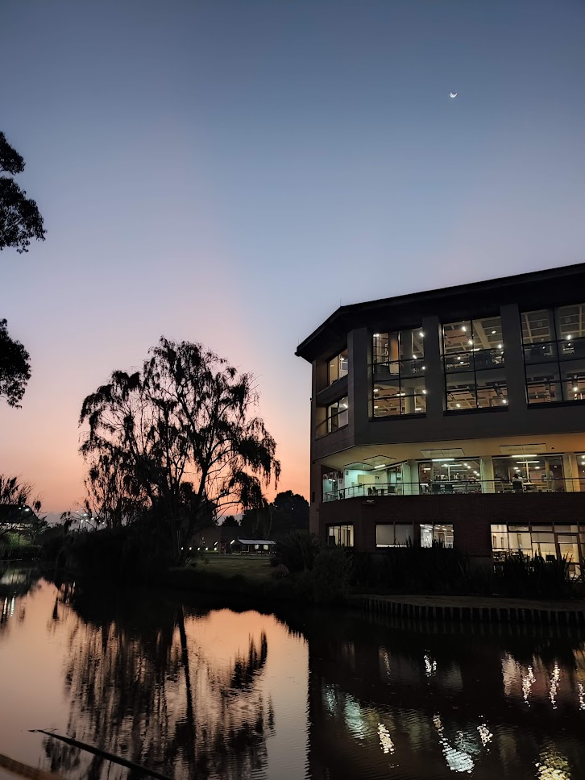
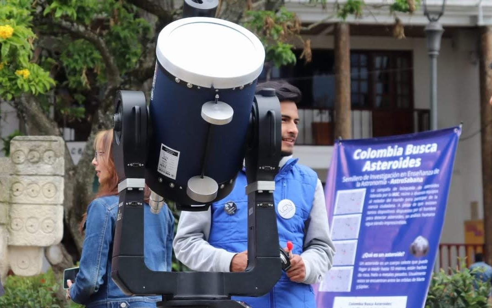
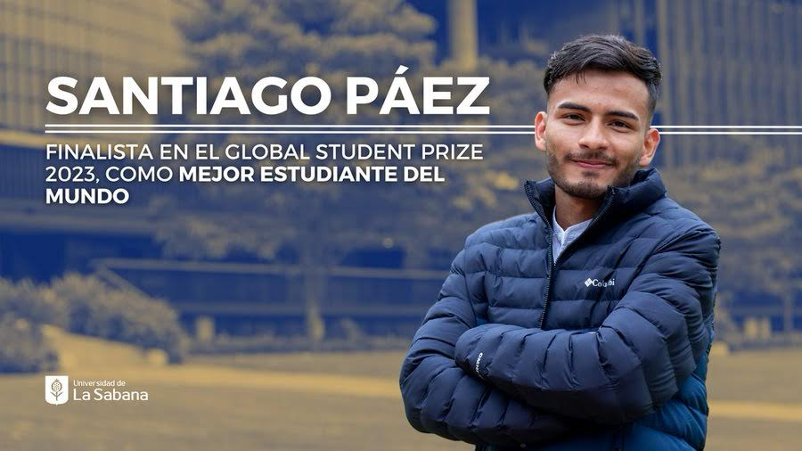
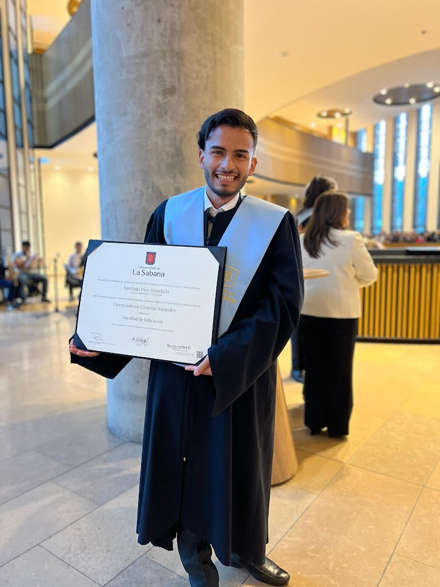

## Admisión en La Sabana y cómo pagarla

  

Durante mi último año de bachillerato, ya había revisado qué tenía que hacer para poder ser astrónomo. El plan A era estudiar la carrera de Física en la Universidad Nacional de Colombia (la Nacho) y luego hacer un posgrado en Astronomía. Sin embargo, este plan se frustró cuando no obtuve ni 600 puntos en el examen de admisión, que ni me alcanzaban para entrar a ninguna carrera. El plan B era estudiar una carrera de ingeniería en la Universidad Distrital Francisco José de Caldas (la Distri) y luego aprovechar la base de matemáticas y física para hacer un posgrado en astronomía. El proceso de admisión en la Universidad Distrital se basaba en la puntuación obtenida en el ICFES, un examen nacional que todos los estudiantes colombianos presentamos cuando estamos a punto de terminar el bachillerato y que puede resultar decisivo para quienes venimos de entornos menos favorecidos. Sobre todo a la hora de obtener becas de estudio o lograr la admisión en muchas universidades.

Mientras realizaba el proceso de admisión en La Distri, nos invitaron a un taller en la Universidad de La Sabana (La Sabana) para conocer el campus y la nueva carrera de Licenciatura en Ciencias Naturales (LCN). Para contextualizar, la Universidad de La Sabana es una universidad privada ubicada a 7 km al norte de Bogotá, en el municipio de Chía. Usme, donde vivía, está en el extremo suroriental de la ciudad. Hasta entonces, solo sabía que era una de las universidades más caras. En el taller conocimos el campus y detalles específicos sobre la LCN, como el plan de estudios, el perfil de los estudiantes y de los egresados, así como las oportunidades de financiación.

Nunca había contemplado la posibilidad de estudiar pedagogía porque no veía ninguna conexión entre mis planes de ser astrónomo y un título de educación. Sin embargo, pregunté a los responsables del taller si, haciendo esa carrera, podría hacer una maestría en astronomía. Aunque no me dijeron específicamente que sí, me dijeron que tendría una importante formación en ciencias naturales y matemáticas, y que, además, la carrera contaba con profesores de astronomía de quienes podría aprender. De alguna forma, vi muy viable que estudiar la LCN también me serviría para mis planes posteriores, así que ese mismo día del taller decidí comenzar el proceso de admisión en La Sabana.

Por supuesto, las posibilidades económicas de mi familia no daban para pagarme una carrera en La Sabana ni en ninguna otra universidad privada, pero una de las opciones de financiación que nos presentaron fue un crédito condonable de la Secretaría de Educación Distrital (SED) que podría financiar el 100 % de la matrícula en una universidad privada, además de proporcionar una ayuda económica semestral para gastos de manutención. Estaba diseñado para favorecer a estudiantes de contextos como el mío, pero con relativamente buenos resultados en el examen del ICFES. Estudiar la LCN financiada con un crédito condonable fue entonces mi plan C para ser astrónomo.

Me admitieron en la Universidad de La Sabana poco después de iniciar el proceso de admisión, pero la financiación, lo más importante, era un proceso más lento y lleno de incertidumbre. Por esas mismas fechas, recibí la notificación de que tampoco había sido admitido en La Distri, por lo que mis tres planes para acceder a la educación superior en ese momento se habían reducido a uno solo, que dependía de que recibiera la financiación completa de la SED. Por supuesto, también podía esperar un semestre y volver a intentar el examen de La Nacho y esperar a ser admitido, pero no quería esperar; realmente deseaba comenzar la universidad inmediatamente.

Tras varios días de incertidumbre a finales de diciembre de 2018, se publicaron los resultados de la SED y mi nombre aparecía en la lista de beneficiarios. El programa se llama Fondo de Educación Superior para Todos (FEST). Ese fue uno de los momentos más importantes de mi vida: me convertí en el primer miembro de mi familia en recibir una especie de beca para estudiar en la universidad y, probablemente, sería el primero en terminarla. Por supuesto, el hecho de que la ayuda fuese un crédito condonable suponía una gran presión: si no terminaba la carrera, tendría que devolver todo lo que hubiesen invertido en ella, con intereses y seguramente me habría tomado años pagar todo el crédito.

## La Licenciatura en Ciencias Naturales

  

Es imposible contar con detalle cómo viví los diez semestres que duró mi carrera y, mucho menos, intentar hacer un relato cronológico de los distintos momentos. Como cualquier persona en cinco años, empecé siendo uno y salí convertido en otro: crecí en términos profesionales y personales, conocí a personas increíbles y hice amigos que recordaré siempre. También aprendí sobre el mundo, viajé, conocí lugares, pueblos, parques naturales, reservas y colegios, y de cada lugar me llevé algo para mi vida. Estudiar en La Sabana me abrió la mente de una forma que nunca habría anticipado, eliminé prejuicios y descubrí una realidad que no habría visto ni experimentado en otro lugar.

Si consultas la versión de mi CV en esta página, podrás ver con cierto detalle todo lo que hice entre enero de 2019 y marzo de 2024, que son las fechas que abarcan mis estudios de licenciatura. Hice prácticas pedagógicas en diferentes lugares, como colegios, museos, alcaldías y el planetario. También fui tutor de estudiantes becarios, dirigí un grupo de investigación y trabajé para la universidad, y participé en muchos eventos académicos. No pretendo contar aquí cada cosa que hice durante la carrera, sino dar una visión general de mi experiencia.

Creo que lo que más marcó mi etapa como estudiante fue la dedicación que le puse en la universidad. Siempre tuve claro que se trataba de una oportunidad única que no podía dejar escapar. Nunca fui a clase y me fui directamente a casa, sino que pasaba más de doce horas diarias en el campus (verán que es un hábito que nunca he dejado). Durante los dos primeros semestres, lo hacía más por practicidad. Vivía en La Fiscala, en Usme, y para llegar a clase a las 7 a. m., tenía que salir de mi casa a las 4 a. m. Todos los días tomaba el alimentador, un Transmilenio, desde el Portal Usme hasta el Portal Norte, y luego un autobús que iba para Chía y me dejaba frente a la universidad. De regreso, el proceso era el mismo; me regresaba alrededor de las 7 p. m. y llegaba a mi casa alrededor de las 10 p. m., si tenía suerte.

Siempre salía y regresaba a la misma hora, aunque mis clases no comenzaran ni terminaran a las 7 a. m. o a las 7 p. m. Lo hacía por dos razones:
a) Era la forma más fácil de saber cuánto tiempo tenía que destinar para ir y venir de casa a la universidad. Si cambiaba mis horarios, nunca sabría cuánto tiempo me llevaría cada trayecto, ya que la ciudad cambia: la frecuencia de autobuses no es la misma a cada hora del día, hay más o menos tráfico y más o menos gente, y todo eso altera el tiempo que se tarda en recorrer la misma distancia.
b) En la universidad había mejores escritorios, sillas, salas y conexión a internet que en mi casa, así que prefería pasar todo el día allí y asegurarme de tener a mi disposición los mejores recursos para estudiar y hacer las tareas. Realmente aprovechaba y disfrutaba de todos los recursos que la universidad ofrecía. Era consciente de que poder dedicar todos mis días, todos los días, únicamente a estudiar era un privilegio que muchas personas no tienen, ya que muchas tienen que trabajar para poder vivir o ayudar en las tareas del hogar. Afortunadamente, el apoyo de mi familia me lo permitía y creo que siempre me encargué de no desaprovecharlo.

Durante los dos primeros semestres, la dinámica fue la misma, pero, cuando iba a comenzar el tercero, mi hermano y yo nos mudamos cerca de la universidad. Aun así, seguía yendo todo el día al campus. De alguna forma, me acostumbré a hacer todo allí y no era igual de productivo en casa. Estar tanto tiempo en la universidad me llevó a participar en muchas actividades fuera del horario de clases: trabajé como cajero en un restaurante, ayudé en procesos administrativos, impartí talleres, como el que yo había hecho en su momento, y, en general, me involucré mucho con el programa y la facultad, más allá de ser solo un estudiante de licenciatura. Gracias a esos años de estar en múltiples actividades y proyectos fuera de las aulas, aprendí a organizar mi tiempo para poder cumplir con todo sin descuidar las clases ni las demás actividades en las que me involucré.

Cuando estaba en tercer semestre, llegó la pandemia. La viví acompañado de mi hermano en un pequeño altillo de una casa en el norte de la ciudad. Sin duda, esos meses de encierro me llevaron, como seguramente a muchas personas en Colombia y en el mundo, a conocerme a mí mismo de una manera diferente, a generar nuevos hábitos y a recuperar otros que había tenido en algún momento. También fue un tiempo de mucha reflexión e introspección, y llegué a conclusiones en las que aún creo y defiendo.

Durante mi carrera, me formé como profesor de ciencias naturales, estudié pedagogía y didáctica y aprendí a planificar, implementar y evaluar estrategias de enseñanza en aulas convencionales y en espacios no formales como museos, centros comerciales y festivales de ciencia. Sin duda, y sin planearlo, durante mi carrera descubrí mi gusto por enseñar, por compartir con los demás mis conocimientos y por intentar transmitir el amor que siento por la astronomía y por aprender. También tomé conciencia de la importancia de los profesores en la sociedad y de que es una profesión titánica.

Durante mi carrera también afiancé mi pasión por la astronomía y siempre tuve claro que graduarme era 1un pequeño paso para alcanzar mi objetivo de ser astrónomo. Seguí aprendiendo, leyendo y convenciéndome de que la astronomía era lo que quería para mi vida.

## Top 50 en el Global Student Prize

  

Uno de los momentos que más marcó mi etapa en La Sabana fue cuando resulté finalista del Global Student Prize 2023. Sin duda, fue una experiencia que me marcó profundamente y que espero describir con más detalle en otra entrada del blog. A grandes rasgos, ser finalista y recibir tanta atención mediática fue algo para lo que nunca pude estar preparado. Aunque, afortunadamente, como la mayoría de las noticias, tuvo su momento álgido y todo volvió rápidamente a la normalidad.

El Global Student Prize es una iniciativa de las fundaciones Varkey y Chegg.org que busca reconocer a estudiantes de todos los niveles que, en su opinión, han tenido un impacto en sus comunidades y han contribuido a generar cambios en ellas. Mis profesores y amigos, que conocían el premio, me animaron a presentar mi candidatura, aunque reconozco que no puse todo mi empeño en ello. De hecho, alguien llegó a comentar que otra persona que había preparado mejor su solicitud seguramente tendría más posibilidades de ser seleccionada, a pesar de tener menos cosas que mostrar.

Cuando resulté seleccionado, fue una sorpresa total y aún hoy tengo dudas sobre las verdaderas razones por las que terminé entre los 50 finalistas. Supongo que fue la combinación de una historia que, contada de cierta manera, resulta conmovedora, más el apoyo institucional (sea lo que sea que eso signifique). Desde el momento en que me notificaron que había sido seleccionado y me dijeron que iban a organizar una cobertura con los medios de comunicación, supe que sería una noticia rápida, de esas que salen, se comentan durante una semana y luego se olvidan. Sabía que el tiempo que iba a recibir atención sería reducido y lo único que quise hacer con tanta atención momentánea fue dejar un mensaje, un mensaje que tal vez no generaría mucho impacto de inmediato, pero que quería que quedara registrado: **enaltecer de la profesión docente**.

Siempre he escuchado a personas de muchas profesiones decir que la suya es de las más importante para la sociedad, sea cual sea esa profesión. Yo no quería caer en lo común de decir que la docencia es la profesión más importante para la sociedad, pero sí quería transmitir un mensaje sobre la importancia de los maestros. Quería hablar de cómo tenemos una deuda con su reputación, de como algunas familias llegan a decepcionarse de los hijos que quieren ser profesores, de como las carreras de pedagogía son generalmente las más fáciles de entrar porque casi nadie quiere y de cómo la mayoría de las personas opina sobre cómo debe ser la educación como si cualquiera tuviera la solución a todos sus problemas, cosa que no pasa con otras profesiones. Nadie sin una mínima preparación puede decirle a un médico, un ingeniero, un técnico o un chef cómo hacer su trabajo. Sin embargo, en el caso de la educación, todo el mundo parece tener la respuesta a todos los problemas, sin ni siquiera entender la diferencia entre educación, pedagogía y didáctica.

Por eso, en cada entrevista, cada nota, cada vídeo, he intentado dejar claro lo importante que es la figura del docente, cómo los países que más apuestan por la educación son los que más se desarrollan y cómo donde ser profesor es motivo de orgullo y admiración es donde más se prospera.

Nunca me gustó que me llamaran uno de los "mejores estudiantes del mundo" o "el mejor estudiante de Colombia", ya que fui el único colombiano nominado ese año (cosa que no es cierta, porque una estudiante colombiana de doctorado en Francia también fue nominada, solo que su nominación apareció por ese país). Porque simplemente no lo soy, ni lo fui. No hay criterios definidos para ganar ese título y, por supuesto, no son los que evalúan los seleccionadores del premio.

# El final de mi licenciatura

  

Un día, durante mi ultimo semestre en una ceremonia de reconocimiento por haber obtenido el mejor puntaje del examen Saber Pro de la Licenciatura en Ciencias Naturales (que de hecho compartí con otro compañero porque obtuvimos el mismo puntaje) una persona me dijo: "este definitivamente fue tu año". Eso me puso a pensar durante toda la ceremonia. Durante el ultimo año estuve bastante ocupado y no había tenido la oportunidad de hacer el ejercicio de reflexión sobre lo que había conseguido hasta entonces: había tenido un trabajo en educación muy bien pago por primera vez, había conocido el mar, había volado en avión por primera vez, había salido del país, había usado un telescopio histórico con un espejo principal de 1 metro de diámetro para tomar datos de exoplanetas, había sido seleccionado en los 50 finalistas del Global Student Prize y ahora estaba recibiendo un reconocimiento por mi resultado en el Saber Pro y en pocos meses me graduaría como Licenciado en Ciencias Naturales. Creo que de alguna esa persona sí tenía razón y el 2023 fue "mi año" como ella dijo. 

A los pocos meses, terminé y defendí mi trabajo de grado, una especie de tesis que, en mi opinión, recoge muchas de las habilidades y conocimientos que adquirí en mi formación como profesor de ciencias naturales, así como cosas que aún tenía que aprender y que aún hoy me faltan, porque nunca nada es perfecto, pero, sin duda, cuando escribí ese documento, hice lo mejor que mi yo de ese momento podía hacer.

El 5 de marzo de 2024 me gradué con reconocimiento por mi trabajo de fin de grado meritorio como licenciado en Ciencias Naturales de la Universidad de La Sabana. Además, volví a ser reconocido por mi puesto en el Global Student Prize y puse fin a una de las etapas más bonitas que jamás haya podido imaginar, acompañado de mi familia y de mis amigos más importantes, tanto en persona como a distancia.

Para entonces, ya había comenzado a dar los pasos necesarios para la siguiente meta y estaba haciendo unas prácticas con el equipo de Bachillerato Internacional de la SED, que era un requisito para que me condonaran el crédito que había pagado por mi carrera, que fue más de 84 millones de pesos. 9 días después de mi graduación, comencé el proceso de admisión a la maestría en Astrofísica de la UNAM, cuyos detalles cuento en otro post de este blog.